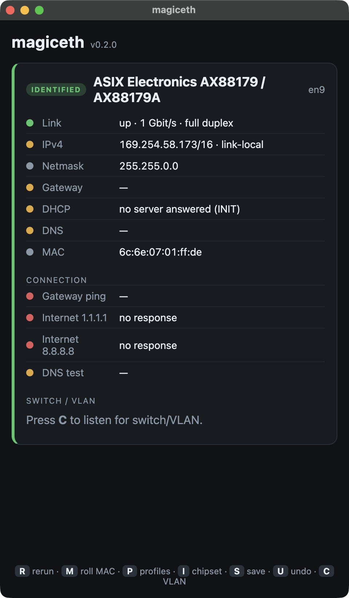
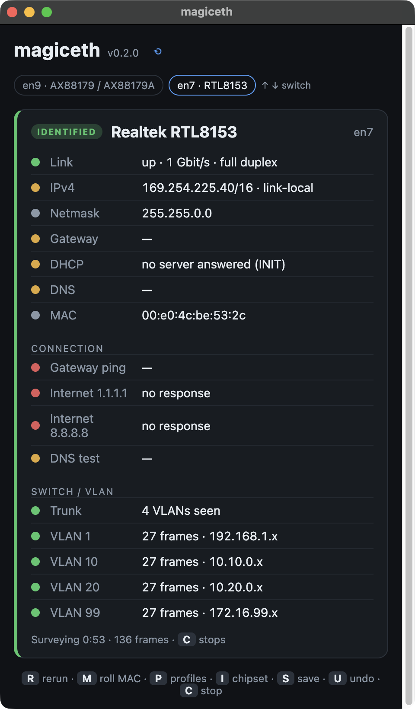
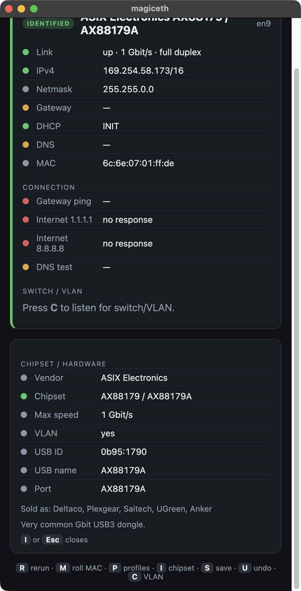
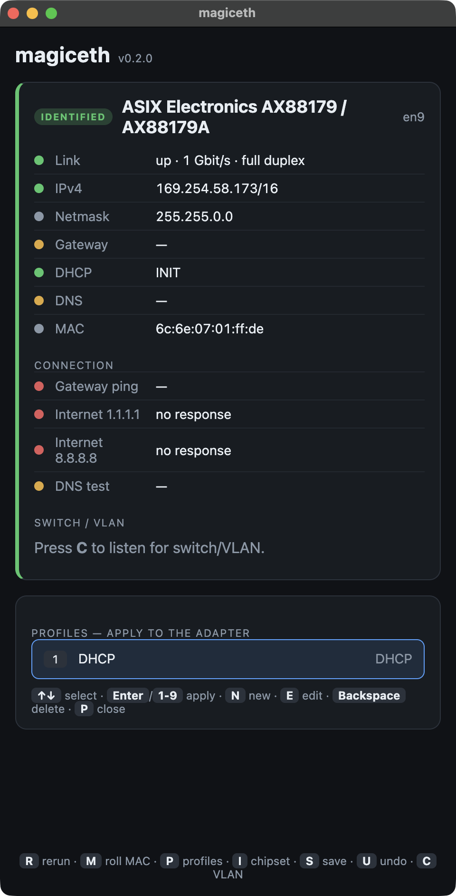

# magiceth

> One-handed network port diagnostics via a USB-to-ethernet dongle.


Plug in a USB-ethernet dongle, connect it to a network port, and immediately see everything a
network technician needs to troubleshoot the port — IP, DHCP, gateway, DNS, link speed, ping
to the gateway and the internet, and (optionally) VLAN/switch info via LLDP/CDP. Change the MAC
address or switch between saved DHCP/static profiles with a couple of keystrokes. Everything is
designed to be operable **with one hand** — for the technician holding the laptop in the other
up by the rack.

Works on **Windows, macOS, and Linux** (arm64 + amd64). The tool is a thin Electron GUI that
orchestrates the OS's own network commands — no custom drivers, no background service.

<p align="center">
  
</p>

<p align="center">
  <em>A port with no DHCP server: link is up at 1 Gbit/s full duplex, but the address is a
  self-assigned 169.254 one and nothing answers — diagnosed without typing a command.</em>
</p>

---

## Features

- **Identification** — detects the dongle on insertion and shows chipset + capabilities (VID:PID is looked up against a built-in database). Press `I` for the chipset sub-view: max speed, VLAN support, the brands that resell it and the raw USB IDs. Deltaco, Plexgear, Saitech, Apple, UGreen, and others are resellers — the underlying chipset (ASIX, Realtek, …) is what matters.
- **Diagnostics** — IP/mask, gateway, DNS, full DHCP info (server, lease, domain), link speed/duplex, and MAC. Runs automatically as soon as the dongle gets link.
- **Connectivity test** — pings the gateway + `1.1.1.1`/`8.8.8.8` _bound to the dongle_ (not via Wi-Fi), plus a DNS test against the DHCP-assigned server. Five packets per target, so latency comes with jitter and a packet-loss figure that means something.
- **Speed test** _(manual, `T`)_ — measures what the uplink behind the port actually delivers, in both directions, bound to the dongle. Numbers appear within a second and update as it runs, so a 1 Mbit uplink is obvious long before the test ends. It transfers real data to `speed.cloudflare.com` — up to ~200 MB each way, about 20 s — and **never runs on its own**; `T` starts it and `T` stops it early.
- **Port survey / VLAN discovery** _(optional, macOS/Linux)_ — press `C` on an uplink and every 802.1Q VLAN carried on it is listed as it is discovered, with a frame count and the addressing seen inside each one. It reads the tags straight off the wire, so it works on **any** switch, managed or not — no LLDP required. When the switch does advertise, LLDP/CDP adds its name, port and management IP on top. Runs until you stop it. Not implemented on Windows (it would need tshark + Npcap); the app says so instead of failing. Measured behaviour and the evidence behind it: [docs/VLAN-FINDINGS.md](docs/VLAN-FINDINGS.md).
- **Active control** — roll a new (locally-administered) MAC, switch between DHCP and static profiles, create/edit profiles inline, and undo the last change.

<p align="center">
  
</p>

## Hardware support

Most USB-ethernet dongles are built on a handful of chipsets. `magiceth` recognizes them via
`USB VID:PID` (see [`resources/chipsets.json`](resources/chipsets.json)) — including ASIX AX88179/772,
Realtek RTL8153/8152/8156, Microchip/SMSC LAN7500/7800, and Apple's USB adapter. Unknown dongles
usually work anyway via the OS's own driver — press `I` for their raw USB IDs, which is exactly
what a "please add this chipset" issue or PR needs.

<p align="center">
  
</p>

## Platform status

| Platform                | Status                                                                                                             |
| ----------------------- | ------------------------------------------------------------------------------------------------------------------ |
| **macOS** (arm64/amd64) | Read-only diagnostics live-verified; privileged actions manually verified                                          |
| **Windows 11** (x64)    | Identification, diagnostics, ping and DHCP/static profile switching verified on real hardware; MAC rolling not yet |
| **Linux** (arm64/amd64) | Implemented against documented command formats; parsers unit-tested — **verify on real hardware**                  |

On Linux the DHCP-vs-static readout is inferred from the address lifetime that `ip -j addr`
reports, which is the one part of the port readout that has not been checked against a live
machine yet.

## Installation

### Prebuilt binary

Download the latest build for your platform from [Releases](https://github.com/carlhannes/magiceth/releases).
The builds are **unsigned** (internal tool) — see [SECURITY.md](SECURITY.md) regarding warnings from
Gatekeeper/SmartScreen.

### From source

```sh
git clone https://github.com/carlhannes/magiceth.git
cd magiceth
npm install
npm run dev        # starts the app in development mode
```

## Usage

Launch the app (does **not** require admin). With a dongle plugged in, identification and
diagnostics are shown automatically. Everything is controlled from the keyboard:

| Key               | Action                                                                 |
| ----------------- | ---------------------------------------------------------------------- |
| `↑` `↓`           | Switch selected dongle (or navigate the profile panel)                 |
| `R` / space       | Re-run diagnostics                                                     |
| `C`               | Start / stop the port survey (VLANs on the wire, LLDP/CDP)             |
| `T`               | Start / stop the speed test (real transfer, see above)                 |
| `I`               | Open/close the chipset sub-view (capabilities + raw USB IDs)           |
| `M`               | Roll a new MAC address                                                 |
| `P`               | Open/close the profile panel                                           |
| `1`–`9` / `Enter` | Apply a profile to the adapter                                         |
| `N` / `E`         | New / edit the selected profile (the form is filled in with the mouse) |
| `Backspace`       | Delete the selected profile                                            |
| `S`               | Save the current config as a profile                                   |
| `U`               | Undo the last change                                                   |

<p align="center">
  
</p>

### Privileged actions

Reads/diagnostics run unprivileged. Actions that _change_ the adapter (MAC, IP config) or
capture packets (LLDP/CDP) require admin/root and request it **per action** via an OS prompt
(macOS password dialog, Linux `pkexec`, Windows UAC). See [SECURITY.md](SECURITY.md).

### What leaves the machine

Everything the tool does stays on the local link, with one exception you start yourself: the
speed test (`T`) transfers data to and from `speed.cloudflare.com`. Nothing about your network is
sent with it — it is a volume of filler bytes, timed — but it is outbound traffic to a third
party, it uses real bandwidth on the network under test, and it needs a working internet
connection. It runs only when you press `T`.

## Building & packaging

```sh
npm run build      # compile main/preload/renderer to out/
npm run package    # build an installable app with electron-builder (per platform)
npm run typecheck  # tsc --noEmit (main + renderer + tests)
npm run lint       # eslint
npm test           # vitest (pure parsers/functions)
```

Unsigned, unpacked Windows build from any platform (no Wine):

```sh
npx electron-builder --win --x64 --dir
```

## How it works

`magiceth` runs the OS's own commands (`ifconfig`/`ipconfig`, `ip`, `networksetup`, `netsh`,
`ping`, `tcpdump`, …) via a shared, injection-safe helper and parses the output into typed
objects. Platform differences sit behind a `PlatformOps` interface. See
**[docs/ARCHITECTURE.md](docs/ARCHITECTURE.md)** for the full picture.

## Contributing

Contributions are welcome — new chipsets, platform verification, bug fixes. See
[CONTRIBUTING.md](CONTRIBUTING.md) and [CODE_OF_CONDUCT.md](CODE_OF_CONDUCT.md).

## Disclaimer

A tool for network troubleshooting on your own/authorized equipment. Active actions (MAC change,
IP reconfiguration) change your actual network configuration — use with good judgment.

## License

[WTFPL v2](LICENSE) © 2026 carlhannes
