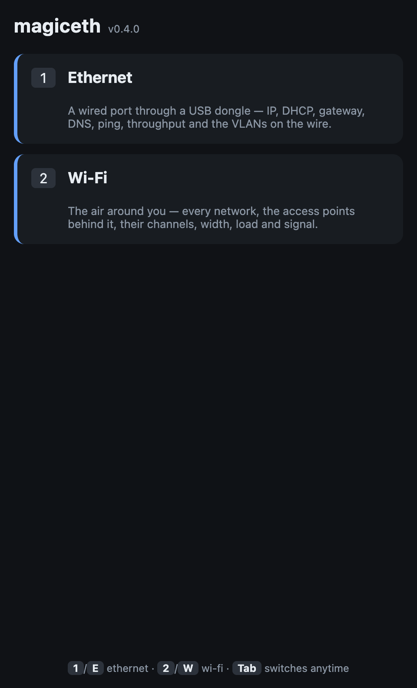
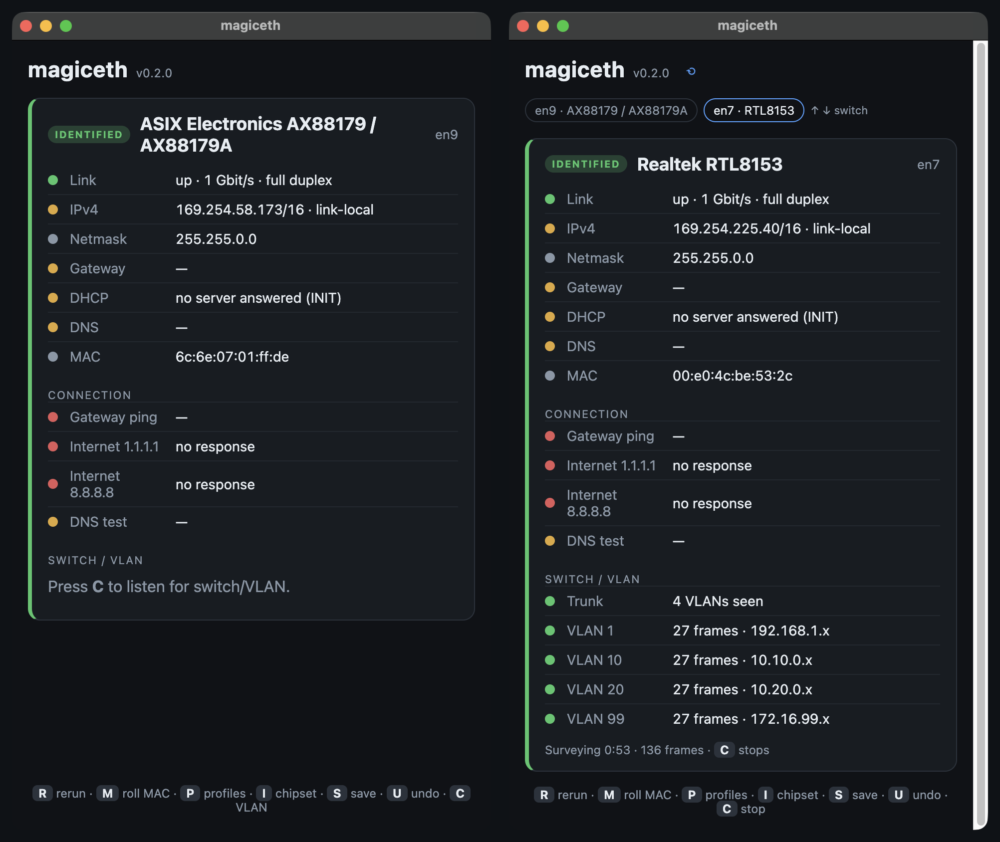
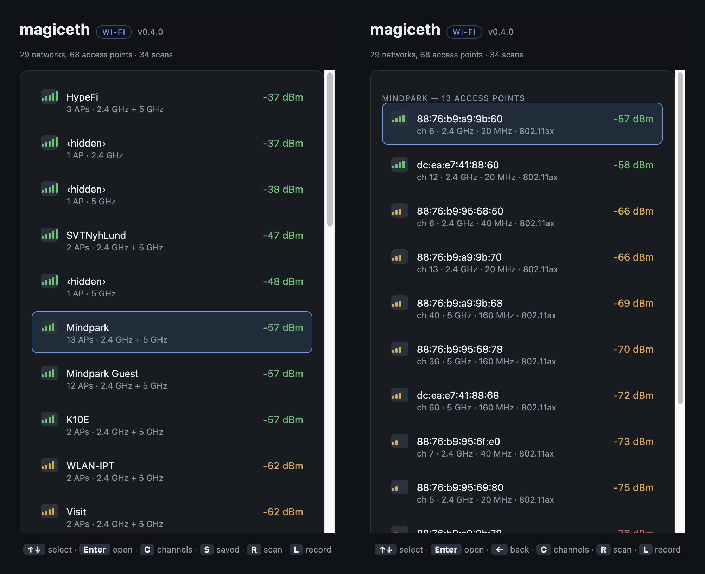
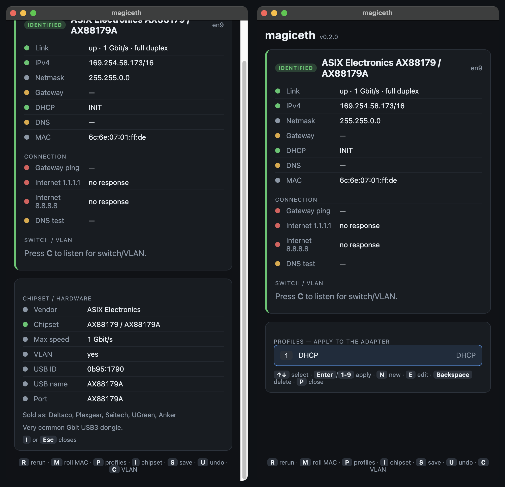
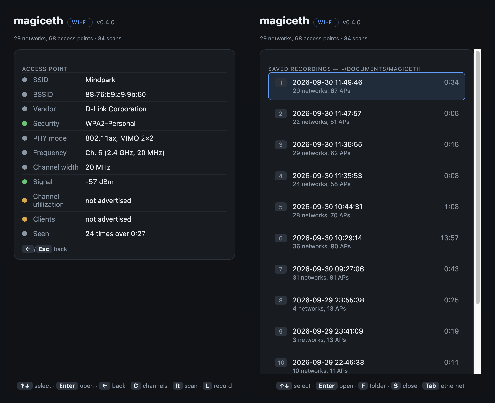
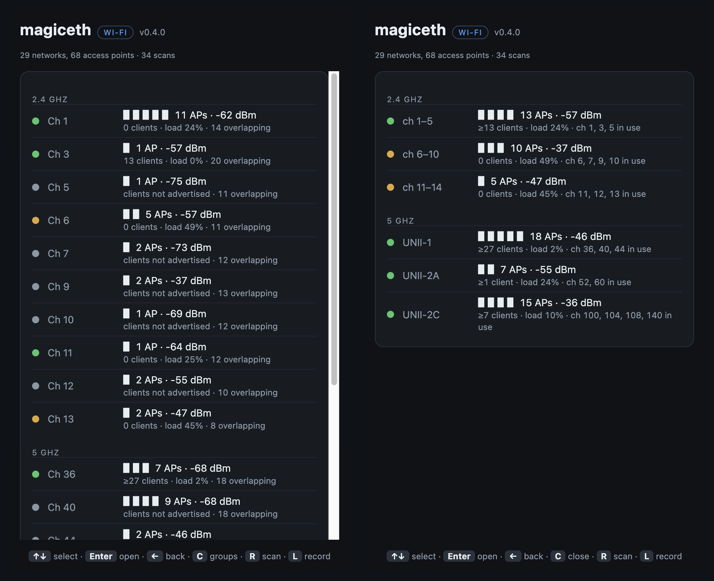

# magiceth

> One-handed network diagnostics: a wired port through a USB dongle, or the Wi-Fi around you.


Plug in a USB-ethernet dongle, connect it to a network port, and immediately see everything a
network technician needs to troubleshoot the port — IP, DHCP, gateway, DNS, link speed, ping
to the gateway and the internet, throughput in both directions, and (optionally) VLAN/switch info
via LLDP/CDP. Change the MAC address or switch between saved DHCP/static profiles with a couple of
keystrokes. Everything is designed to be operable **with one hand** — for the technician holding
the laptop in the other up by the rack.

The machine's **own Wi-Fi and built-in Ethernet** are listed too, so there is something to
diagnose with no dongle attached. Dongles always sort first, and one you plug in takes the
selection by itself.

**Wi-Fi mode** _(macOS)_ points the same idea at the air: every network in earshot, the access
points behind each one, and for each of them channel, width, band, PHY generation with MIMO stream
count, security, channel utilization, client count and manufacturer — all read out of the raw
beacon, so nothing needs monitor mode and your connection stays up. Press `L` and it records while
you walk a site, writing CSVs you can open in a spreadsheet.

The app opens on a chooser between the two; `Tab` switches at any time.

<p align="center">
  
</p>

Works on **Windows, macOS, and Linux** (arm64 + amd64). The tool is a thin Electron GUI that
orchestrates the OS's own network commands — no custom drivers, no background service.

<p align="center">
  
</p>

<p align="center">
  <em>Left: a port with no DHCP server — link up at 1 Gbit/s full duplex, but the address is a
  self-assigned 169.254 one and nothing answers, diagnosed without typing a command. Right: the
  port survey (<code>C</code>) listing every VLAN carried on a trunk.</em>
</p>

<p align="center">
  
</p>

<p align="center">
  <em>Wi-Fi mode in an office. Left: dozens of access points grouped under the network names you
  would actually recognise them by. Right: opening one shows every access point serving it — here
  thirteen, across both bands at 20, 40 and 160 MHz, with more than one sharing channel 6. The key
  legend stays put however long the list gets.</em>
</p>

---

## Features

- **Ports, not just dongles** — USB dongles plus the machine's built-in Wi-Fi and Ethernet. Loopback, bridges, Docker/veth, VPN tunnels and internal plumbing are left out, using a structural signal on each OS rather than name matching: on macOS the ports macOS itself made into network services, on Linux the sysfs `device` entry only real hardware has, on Windows the `Virtual`/`HardwareInterface` properties.
- **Identification** — detects the dongle on insertion and shows chipset + capabilities (VID:PID is looked up against a built-in database). Press `I` for the chipset sub-view: max speed, VLAN support, the brands that resell it and the raw USB IDs. Deltaco, Plexgear, Saitech, Apple, UGreen, and others are resellers — the underlying chipset (ASIX, Realtek, …) is what matters.
- **Diagnostics** — IP/mask, gateway, DNS, full DHCP info (server, lease, domain), link speed/duplex, and MAC. Runs automatically as soon as the dongle gets link.
- **Connectivity test** — pings the gateway + `1.1.1.1`/`8.8.8.8` _bound to the dongle_ (not via Wi-Fi), plus a DNS test against the DHCP-assigned server. Five packets per target, so latency comes with jitter and a packet-loss figure that means something.
- **Speed test** _(manual, `T`)_ — measures what the uplink behind the port actually delivers, in both directions, bound to the dongle. Numbers appear within a second and update as it runs, so a 1 Mbit uplink is obvious long before the test ends. It transfers real data to `speed.cloudflare.com` — up to ~200 MB each way, about 20 s — and **never runs on its own**; `T` starts it and `T` stops it early.
- **Port survey / VLAN discovery** _(optional, macOS/Linux)_ — press `C` on an uplink and every 802.1Q VLAN carried on it is listed as it is discovered, with a frame count and the addressing seen inside each one. It reads the tags straight off the wire, so it works on **any** switch, managed or not — no LLDP required. When the switch does advertise, LLDP/CDP adds its name, port and management IP on top. Runs until you stop it. Not implemented on Windows (it would need tshark + Npcap); the app says so instead of failing. Measured behaviour and the evidence behind it: [docs/VLAN-FINDINGS.md](docs/VLAN-FINDINGS.md).
- **Active control** — roll a new (locally-administered) MAC, switch between DHCP and static profiles, create/edit profiles inline, and undo the last change.
- **WLAN mode** _(macOS)_ — the same idea pointed at the air. Every network in earshot, the access points behind each one, and per access point: channel, band, width, PHY generation with MIMO stream count (`802.11be, MIMO 4×4`), security read from the actual AKM suites, channel utilization, client count, country, and the
  manufacturer looked up from the IEEE OUI registries — including for the randomised BSSIDs modern
  access points use, where the maker is recovered from the beacon's own vendor elements instead. All of it is decoded from the raw beacon, so **no monitor mode and no disconnection** — your Wi-Fi keeps working while you scan. Press `L` to record: it keeps scanning while you walk a site and gives min/max/average for signal, clients and channel load, keeping access points you have moved away from. macOS hands out this detail only to an app with Location access, which magiceth asks for once — see [docs/WIFI-FINDINGS.md](docs/WIFI-FINDINGS.md) for exactly what is and is not obtainable.

### Cheap things happen by themselves; expensive things need intent

Everything the tool does falls into one of two classes, and which one it is decides how it starts.

**Cheap enough to be automatic.** Reading OS state, a handful of ping packets, one DNS query — a
few kilobytes and a second or two, on a network that will not notice. These run on their own the
moment a port appears or its link changes, because "plug it in and see" is the entire promise. No
key needed, no permission needed.

**Expensive enough to want intent.** The speed test moves up to 400 MB across someone else's
uplink. The port survey wants an admin password and then captures traffic for as long as you leave
it running. Neither ever starts by itself, and neither starts on a single keystroke: **the first
press explains what it is about to do, the second press does it.** Any other key in between
cancels it.

That is also why those two have no standing hint text. Instead of a paragraph sitting on screen
being scrolled past forever, the explanation appears exactly when it is relevant — as the thing you
are agreeing to. The list stays short and the window stays readable.

**Changing configuration** is the same idea applied to risk rather than cost. `M`, `U` and applying
a profile act on the first press on a **dongle** — one-handed operation at a rack is the point —
but ask first on a **built-in** port, because that is the machine's own connection and a stray
keystroke should not be able to take it down.

## Hardware support

Most USB-ethernet dongles are built on a handful of chipsets. `magiceth` recognizes them via
`USB VID:PID` (see [`resources/chipsets.json`](resources/chipsets.json)) — including ASIX AX88179/772,
Realtek RTL8153/8152/8156, Microchip/SMSC LAN7500/7800, and Apple's USB adapter. Unknown dongles
usually work anyway via the OS's own driver — press `I` for their raw USB IDs, which is exactly
what a "please add this chipset" issue or PR needs.

<p align="center">
  
</p>

<p align="center">
  <em>The two Ethernet sub-views: the chipset readout (<code>I</code>) with capabilities and raw
  USB IDs, and the profile panel (<code>P</code>).</em>
</p>

## Platform status

| Platform                | Status                                                                                                         |
| ----------------------- | -------------------------------------------------------------------------------------------------------------- |
| **macOS** (arm64/amd64) | Read-only diagnostics live-verified; privileged actions manually verified; **Wi-Fi mode live-verified**        |
| **Windows 11** (x64)    | Identification, diagnostics, ping, DHCP/static profile switching and MAC rolling all verified on real hardware |
| **Linux** (arm64/amd64) | Implemented against documented command formats; parsers unit-tested — **verify on real hardware**              |

On Linux the DHCP-vs-static readout is inferred from the address lifetime that `ip -j addr`
reports, which is the one part of the port readout that has not been checked against a live
machine yet.

## Installation

### Prebuilt binary

Download the latest build for your platform from [Releases](https://github.com/carlhannes/magiceth/releases).
The builds are **unsigned** (internal tool) — see [SECURITY.md](SECURITY.md) regarding warnings from
Gatekeeper/SmartScreen.

### From source

```sh
git clone https://github.com/carlhannes/magiceth.git
cd magiceth
npm install
npm run dev        # starts the app in development mode
```

## Usage

Launch the app (does **not** require admin). It opens on a chooser with two modes — press `1`/`E`
for **Ethernet** or `2`/`W` for **Wi-Fi**. `Tab` switches between them at any time and `Esc` steps
back out. Everything is controlled from the keyboard.

### Ethernet mode

With a dongle plugged in, identification and diagnostics are shown automatically.

| Key               | Action                                                                 |
| ----------------- | ---------------------------------------------------------------------- |
| `↑` `↓`           | Switch selected port (or navigate the profile panel)                   |
| `R` / space       | Re-run diagnostics                                                     |
| `C`               | Start / stop the port survey (VLANs on the wire, LLDP/CDP)             |
| `T`               | Start / stop the speed test (real transfer, see above)                 |
| `I`               | Open/close the chipset sub-view (capabilities + raw USB IDs)           |
| `M`               | Roll a new MAC address                                                 |
| `P`               | Open/close the profile panel                                           |
| `1`–`9` / `Enter` | Apply a profile to the adapter                                         |
| `N` / `E`         | New / edit the selected profile (the form is filled in with the mouse) |
| `Backspace`       | Delete the selected profile                                            |
| `S`               | Save the current config as a profile                                   |
| `U`               | Undo the last change                                                   |

### Wi-Fi mode _(macOS)_

Entering the mode scans by itself. The list is networks; opening one shows the access points behind
it; opening an access point shows everything known about it.

<p align="center">
  
</p>

<p align="center">
  <em>Left: one access point in full — the manufacturer comes from the IEEE registry, security is
  read from the actual AKM suites, and the min/max/average figures are what the recording saw while
  walking around. Right: past recordings (<code>S</code>), which open through these same screens.</em>
</p>

| Key           | Action                                                                        |
| ------------- | ----------------------------------------------------------------------------- |
| `↑` `↓`       | Move through the list                                                         |
| `Enter` / `→` | Open the selected network, then the selected access point                     |
| `Esc` / `←`   | Back up a level; from the top, back to the mode chooser                       |
| `R` / space   | Scan again now                                                                |
| `L`           | Start / stop recording — keeps scanning and tracks min/max/avg while you move |
| `C`           | Channel view, then the same grouped into bands' blocks, then back             |
| `S`           | Saved recordings — open one to view it; `F` reveals it in the file manager    |

**Recordings are saved to `~/Documents/magiceth`** as two CSVs you can open in any spreadsheet: a
time log written as you walk (one row per access point per snapshot, at least two seconds apart)
and an aggregate written when you stop (one row per access point with min/max/average signal,
clients and channel load, grouped so every access point of one network sits together). A run
shorter than three snapshots deletes itself, and quitting mid-recording still finalises the file.
The app reads those same files back, so nothing is stored anywhere else. Two things worth knowing:
macOS may ask once for permission to write to Documents, and if that folder syncs to iCloud your
recordings will sync with it.

<p align="center">
  
</p>

<p align="center">
  <em><code>C</code> cycles through both. Left: each channel with the access points on it, the
  stations they are serving, the load they admit to, and how many more bleed onto it from
  neighbouring channels — the dot follows the advertised load, which is a measurement. Right: the
  same grouped into the non-overlapping thirds on 2.4 GHz and the named regulatory blocks above
  it, where the upper two thirds of 2.4 GHz sit near 50% load while 5 GHz carries more access
  points and more clients at a fraction of that.</em>
</p>

Client counts are what each access point advertises, de-duplicated per radio: one radio
broadcasting five SSIDs reports the same station count five times, so adding them up naively would
have read 30 clients where there were 6. A `≥` means only some of the access points on that
channel advertised a count, so the figure is a floor.

Scanning is passive and read-only: it never associates with anything and never disconnects you.
The first scan asks macOS for Location access, which is the only way it will reveal access point
identifiers — see [docs/WIFI-FINDINGS.md](docs/WIFI-FINDINGS.md).

`M`, `U` and applying a profile change real network configuration. On a **dongle** they act on the
first press — that is the one-handed point. On a **built-in** port they ask first and act on the
second press of the same key, because that is the machine's own connection; any other key cancels.

### Privileged actions

Reads/diagnostics run unprivileged. Actions that _change_ the adapter (MAC, IP config) or
capture packets (LLDP/CDP) require admin/root and request it **per action** via an OS prompt
(macOS password dialog, Linux `pkexec`, Windows UAC). See [SECURITY.md](SECURITY.md).

### What leaves the machine

Everything the tool does stays on the local link, with one exception you start yourself: the
speed test (`T`) transfers data to and from `speed.cloudflare.com`. Nothing about your network is
sent with it — it is a volume of filler bytes, timed — but it is outbound traffic to a third
party, it uses real bandwidth on the network under test, and it needs a working internet
connection. It runs only when you press `T`.

## Building & packaging

```sh
npm run build      # compile main/preload/renderer to out/
npm run package    # build an installable app with electron-builder (per platform)
npm run typecheck  # tsc --noEmit (main + renderer + tests)
npm run lint       # eslint
npm test           # vitest (pure parsers/functions)
```

Everything is unsigned — no macOS notarization, no Windows certificate — so macOS needs
right-click → Open and Windows shows SmartScreen → More info → Run anyway.

A full release is four files, and all four build from macOS with no Wine involved (electron-builder
fetches its own NSIS toolchain):

| Artifact                    | Built by                                    | For                              |
| --------------------------- | ------------------------------------------- | -------------------------------- |
| `magiceth-<v>-arm64.dmg`    | `npm run package -- --mac`                  | macOS, Apple Silicon             |
| `magiceth-<v>.dmg`          | `npm run package -- --mac`                  | macOS, Intel                     |
| `magiceth Setup <v>.exe`    | `npx electron-builder --win nsis`           | Windows installer, x64 + arm64   |
| `magiceth-<v>-portable.exe` | `npx electron-builder --win portable --x64` | Windows, runs without installing |

The Linux AppImage target exists in `electron-builder.yml` but needs a Linux host (or Docker), and
**no part of the Linux path has been run on real hardware** — see [docs/BACKLOG.md](docs/BACKLOG.md)
before publishing one.

## How it works

`magiceth` runs the OS's own commands (`ifconfig`/`ipconfig`, `ip`, `networksetup`, `netsh`,
`ping`, `tcpdump`, …) via a shared, injection-safe helper and parses the output into typed
objects. Platform differences sit behind a `PlatformOps` interface. See
**[docs/ARCHITECTURE.md](docs/ARCHITECTURE.md)** for the full picture.

## Contributing

Contributions are welcome — new chipsets, platform verification, bug fixes. See
[CONTRIBUTING.md](CONTRIBUTING.md) and [CODE_OF_CONDUCT.md](CODE_OF_CONDUCT.md).

## Disclaimer

A tool for network troubleshooting on your own/authorized equipment. Active actions (MAC change,
IP reconfiguration) change your actual network configuration — use with good judgment.

## License

[WTFPL v2](LICENSE) © 2026 carlhannes
